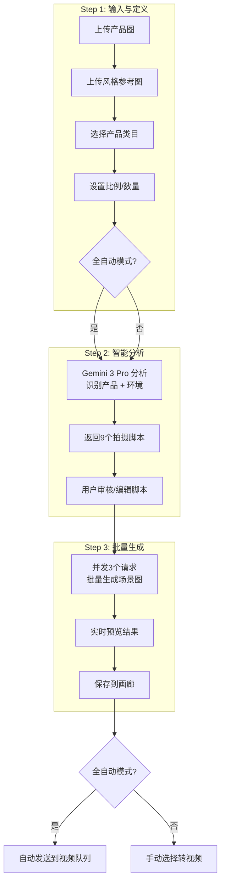
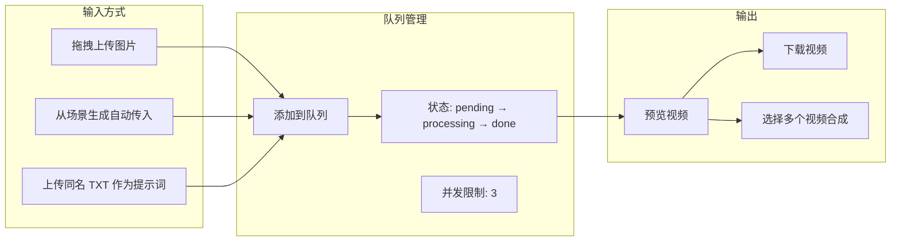
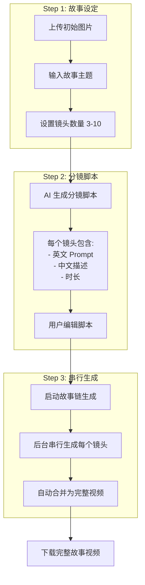
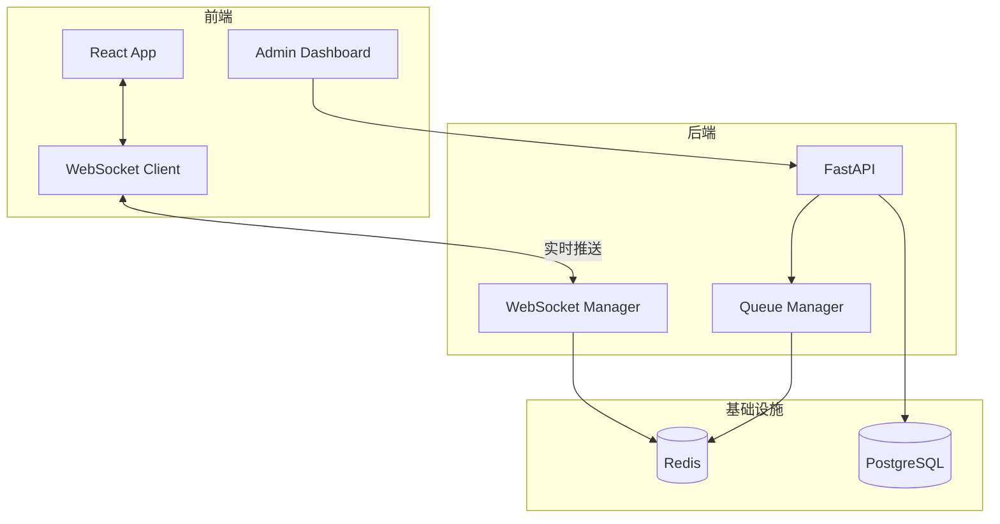

# Banana Product - 智能商品场景生成系统

Banana Product 是一个基于 AI 的自动化商品场景生成与视频制作平台。它可以根据简单的商品图片，自动分析特征、生成多角度场景图，甚至一键生成营销短视频。

## ✨ 主要功能

*   **🎨 批量场景生成**：上传一张白底图，自动分析商品特征，生成 Front, Side, Top 等 9 种不同角度和场景的高质量营销图。
*   **📹 视频生成**：基于生成的图片，一键转换为动态视频（支持 Sora/Veo 等模型接口）。
*   **🎬 一镜到底 (Story Mode)**：自动编排分镜，生成连贯的故事性视频脚本和画面。
*   **👥 多用户管理**：内置完善的用户系统，支持多用户登录、权限隔离（管理员/普通用户）及用量统计。
*   **⚙️ 灵活配置**：支持自定义 API Endpoint 和模型参数，兼容 OpenAI 格式接口。

---

## 🚀 快速部署 (Installation)

本项目基于 Docker Compose 构建，支持一键部署。

### 1. 环境准备
确保服务器已安装：
*   [Docker](https://docs.docker.com/engine/install/)
*   [Docker Compose](https://docs.docker.com/compose/install/)

### 2. 获取代码
将项目代码下载/克隆到本地目录：
```bash
git clone <your-repo-url> auto_banana_product
cd auto_banana_product
```

### 3. 配置环境变量
复制示例配置文件并修改：
```bash
cp .env.example .env  # 如果没有example文件，请直接创建 .env
```
编辑 `.env` 文件，填入必要的 API Key：
```ini
# .env 示例

# 核心绘图模型配置 (OpenAI 兼容接口)
DEFAULT_API_URL=https://your-api-provider.com/v1
DEFAULT_API_KEY=sk-xxxxxxxxxxxxxxxxxxxxxxxx
DEFAULT_MODEL_NAME=gemini-3-pro-image-preview

# 视频生成模型配置
VIDEO_API_URL=http://your-video-api.com/v1
VIDEO_API_KEY=sk-xxxxxxxxxxxxxxxxxxxxxxxx
VIDEO_MODEL_NAME=sora-video-portrait

# 初始管理员账号 (系统首次启动时创建/重置)
ADMIN_USER=admin
ADMIN_PASSWORD=your_secure_password
```

### 4. 启动服务
执行标准 Docker Compose 命令启动：
```bash
docker compose up -d --build
```
等待容器启动完成（首次构建可能需要几分钟）。

---

## 📖 使用教程 (User Guide)

### 1. 访问系统
服务启动后，默认通过以下端口访问（根据 `docker-compose.yml` 配置）：
*   **前端页面**: `http://localhost:33012` (或服务器 IP:33012)
*   **后端 API**: `http://localhost:33013` (仅供调试)

### 2. 登录系统
使用 `.env` 中配置的管理员账号登录：
*   **默认账号**: `admin` (或您设置的 `ADMIN_USER`)
*   **默认密码**: `***REDACTED_ADMIN_PASSWORD***` (或您设置的 `ADMIN_PASSWORD`)

### 3. 功能操作流程

#### A. 批量场景生成



**操作步骤**：
1.  进入 **"批量场景生成"** 标签页
2.  上传商品 **白底图** (Product) 和 **风格参考图** (Reference)
3.  点击 **"智能分析"**，系统将自动拆解商品特征并生成 9 个拍摄脚本
4.  确认脚本无误后，点击 **"开始生成"**
5.  等待生成完成，点击图片可大图预览或保存

#### B. 视频生成



**操作步骤**：
1.  在生成的图片结果中，点击 **"转为视频"** 按钮
2.  系统会自动跳转到 **"视频生成"** 标签页，并填入优化后的提示词
3.  点击 **"开始生成"** 启动队列处理
4.  视频生成为后台异步任务，可在任务列表查看进度
5.  完成后可预览、下载或选择多个视频进行合成

#### C. 故事模式 (一镜到底)



**操作步骤**：
1.  进入 **"故事模式"** 标签页
2.  上传初始图片，输入故事主题 (如 "一杯咖啡的故事")
3.  设置镜头数量，点击 **"生成分镜脚本"**
4.  审核/编辑 AI 生成的分镜脚本
5.  点击 **"开始生成故事"**，等待视频合成完成

#### D. 画廊

浏览和管理所有生成的图片与视频：
- **图片标签页**: 查看批量生成的场景图
- **视频标签页**: 查看生成的视频
- 支持分页、预览、下载、删除

#### E. 用户管理 (管理员仅可见)
1.  点击顶部导航栏右上角的 **"用户管理"** (User Management)
2.  **添加用户**: 创建新的普通用户账号（Sub-users）
3.  **重置密码**: 修改用户密码
4.  **查看统计**: 查看每个用户的图片/视频生成数量统计

---

## 🛠️ 维护与排错

### 查看日志
如果遇到问题，查看 Docker 容器日志：
```bash
# 查看后端日志
docker compose logs -f backend

# 查看前端构建日志
docker compose logs -f frontend
```

### 数据库迁移
系统启动时会自动检查数据库表结构。如果遇到 `502 Bad Gateway` 或数据库错误，请尝试重启后端容器以触发修复逻辑：
```bash
docker compose restart backend
```

---

## 📁 主要目录结构
```
auto_banana_product/
├── backend/            # Python FastAPI 后端
│   ├── main.py        # 核心业务逻辑
│   ├── Dockerfile     # 后端镜像构建文件
│   └── requirements.txt
├── frontend/           # React 前端
│   ├── src/           # 页面源代码
│   ├── Dockerfile     # 前端镜像构建文件
│   └── package.json
├── docker-compose.yml  # 容器编排配置
├── .env                # 配置文件 (不要提交到 Git)
└── .gitignore          # Git 忽略规则
```

---

## 🚀 性能与并发优化

### 架构概览

系统集成了 **Redis** 用于任务队列管理和实时状态推送，**WebSocket** 用于前端实时通知。



### Redis 配置

如果使用外部 Redis 实例（如 1Panel 管理的 Redis），需要在 `docker-compose.yml` 中配置：

```yaml
services:
  backend:
    environment:
      # Redis 配置 - 使用主机名，代码会在运行时自动解析 IP
      - REDIS_HOST=your-redis-container-name
      - REDIS_PORT=6379
      - REDIS_PASSWORD=your_redis_password
      - REDIS_DB=0
```

> **注意**：代码会在启动时自动将主机名解析为 IP 地址，即使 VPS 重启后容器 IP 变化也能正常连接。

### 新增功能

| 功能 | 说明 |
|------|------|
| **管理员实时监控** | 管理员可在"实时监控"页面查看在线用户、活动记录和队列状态 |
| **WebSocket 实时连接** | 前端显示实时连接状态，任务进度实时更新 |
| **并发控制** | 支持全局和用户级并发限制，防止系统过载 |

### 新增 API 端点

| 端点 | 权限 | 说明 |
|------|------|------|
| `WS /ws/{token}` | 用户 | WebSocket 实时连接 |
| `GET /api/v1/admin/live-status` | 管理员 | 获取实时系统状态 |
| `GET /api/v1/admin/user/{user_id}/tasks` | 管理员 | 查看指定用户任务 |
| `GET /api/v1/admin/activities` | 管理员 | 获取用户活动记录 |

### 相关文件

| 文件 | 功能 |
|------|------|
| `backend/queue_manager.py` | Redis 任务队列管理器 |
| `backend/websocket_manager.py` | WebSocket 连接管理器 |
| `frontend/src/hooks/useWebSocket.js` | 前端 WebSocket Hook |
| `frontend/src/AdminDashboard.jsx` | 管理员实时监控面板 |

---

## 📝 更新日志 (Changelog)

### v1.2.0 (2025-12-10) - 监控与统计增强

#### 🎨 自定义网站配置
- **网站标题和副标题**: 管理员可在系统设置中自定义网站标题和副标题
- **浏览器标签页标题**: 自动同步更新浏览器标签页标题
- 配置持久化保存到数据库

#### 📊 用户统计增强
- **今日统计**: 用户管理界面新增"今日图片"和"今日视频"统计卡片
- **准确计数**: 图片统计改用 `SavedImage` 表（实际保存的图片），视频统计改用已完成状态
- **每日自动重置**: 当天统计基于中国时区 00:00 自动重置

#### 🕐 时区修复
- **全局时区**: 所有时间戳统一使用中国时区 (UTC+8)
- **活动记录**: 前端正确解析东八区时间，显示准确的相对时间
- **数据库模型**: `User`、`SavedImage`、`VideoQueueItem`、`UserActivity` 等模型默认时间为东八区

#### 👥 实时监控增强
- **用户状态实时更新**: 
  - 图片生成时显示"正在生成 N 张图片"
  - 视频生成时显示"正在生成视频"
  - 完成后自动重置为"空闲"
- **活动记录增强**: 
  - 新增 `image_gen_complete` 和 `video_gen_complete` 活动类型
  - 活动记录默认只显示最近 12 小时（最多 50 条）
  - 新增"清空"按钮一键删除所有活动记录

#### 🖼️ 画廊功能改进
- **视频画廊保护**: 清除已完成/清除全部操作不会删除画廊中的视频
- **归档机制**: 已完成的视频会被标记为 `archived` 状态而非删除
- **类目筛选**: 画廊视频支持按产品类目筛选
- **Lightbox 优化**: 预览弹窗添加 metadata 样式分隔显示（分辨率、类目、时间）

#### 🎬 视频生成改进
- **类目保存**: 视频队列支持保存产品类目
- **元数据显示**: 视频预览显示创作者、产品类目、创作时间

#### 🔧 其他改进
- **登录后跳转**: 所有用户登录后统一跳转到画廊页面
- **用户管理 UI**: 统计卡片改用更紧凑的布局和高亮样式
- **代码质量**: 修复多处字段名不匹配问题

---

## 📜 License

MIT License - 自由使用和修改

